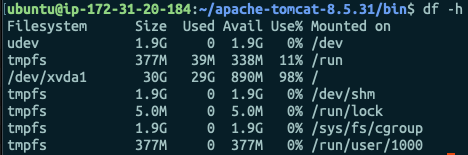
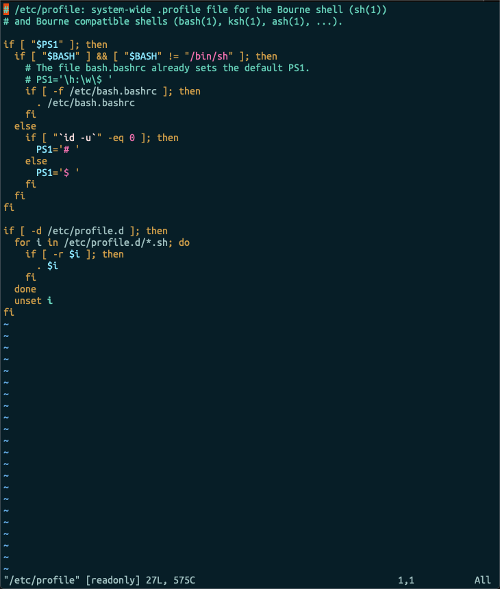
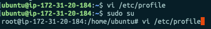
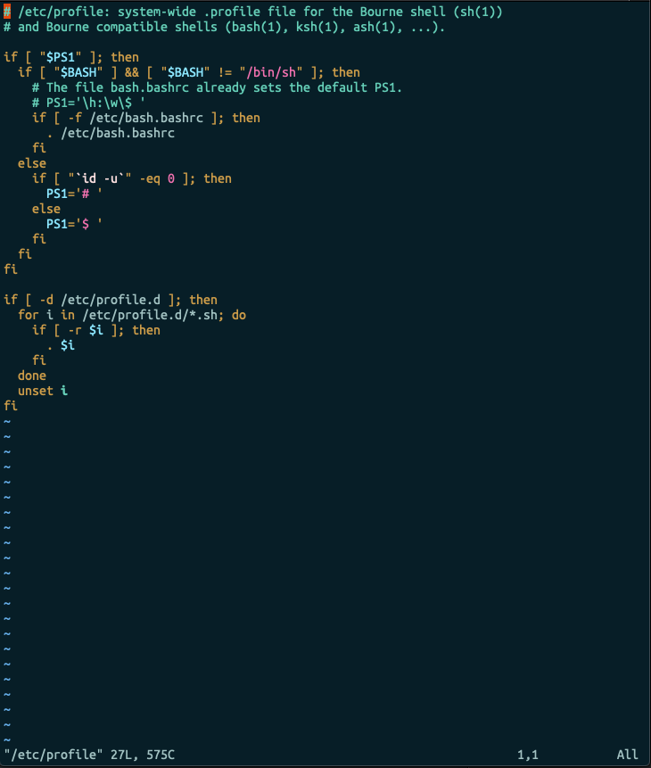
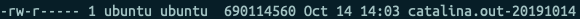
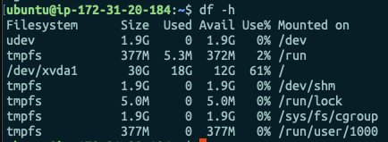

안녕하세요. 

오랜만에 인사드리는 주니어 개발자 한유덕입니다.

오늘은 톰캣 서버의 로그 파일을 관리하는 방법을 알아보려고 해요. 얼마 전에 사내 서버의 용량이 꽉 차서 다운되는 현상이 있었습니다. 용량을 보니, 주 디스크로 쓰이는 폴더의 용량이 어마어마하더라고요. 원인은 바로  각종 log 파일들과 catalina.out 파일이었는데요. 매번 수동으로 지우는 건 무리가 있다고 생각해서, 자동화할 수 있는 방법은 없을까 고민하다 logrotate를 통해 자동화한 경험을 공유해보고자 합니다.



위의 스크린샷이 서버의 디스크 사용 용량인데.. 이미 100%를 넘어서고 있습니다. 이러니 서버가 정상 동작할리가 없죠..? 그래서 로그 파일을 좀 더 뒤져보니..


`catalina.out` 파일이 무려 5.3G를 차지하고 있습니다. 와우.. 

그래서 저는 어떻게 하면 이 `catalina.out` 파일의 용량을 줄이고, 날짜가 오래된 로그 파일들을 삭제할 수 있을까를 고민했는데요. 이미 서버에서 로그 파일을 관리하는 전략을 많은 분들이 포스팅해 놓으셨더라고요 ㅎㅎㅎㅎ 그래서 참고하여 저도 적용해보았습니다. 참고한 포스팅들은 맨 아래 참고하실 수 있습니다.


이번 포스팅에서는 크게

1. catalina.out 파일 자체를 생성하지 않는 방법
2. linux의 기본 패키지인 logrotate를 사용하여 로그 파일을 관리하는 방법

을 알아보도록 하겠습니다.


# 1. Catalina.out 파일 자체를 생성하지 않는 방법

서버에 접속하신 후, `vi /etc/profile` 을 입력합니다. 



위와 같이 `/etc/profile` 파일을 수정할 수 있는 vim 에디터 창이 열립니다. 이 때, 맨 아래를 보면 **readonly** 라고 되어있는데요. 수정할 수 있는 권한이 없다는 얘기입니다. 이럴 때는 보통 `$ sudo su` 를 입력하여 root 계정으로 접속하여 파일에 대한 접근 권한을 수정하거나, root 계정으로 직접 수정하여야 합니다. 저희는 root 계정에서 직접 수정해보겠습니다.  `q!` 를 입력하여 vim 에디터를 종료합니다.



위와 같은 식으로 계정을 변경하고 다시 `$ vi /etc/profile` 을 입력합니다.



아래 **readonly** 라는 표시가 사라지신 걸 확인할 수 있습니다.

그리고 맨 위에 아래와 같은 명령어를 추가합니다. 

```bash
export CATALINA_OUT="dev/null"
```

이번에는 달라진 내용을 저장하고 종료해야하기 때문에, `wq!` 를 입력하여 vim 에디터를 종료합니다.

그리고 profile의 내용 적용을 위해서 

`$ source /etc/profile` 명령어를 실행합니다.

이제 `/etc/profile` 이 서버 내 tomcat 서버의 설정을 덮어쓰게 됩니다. 

그리고 다시 살펴보시면 `catalina.out` 파일 자체가 생성되지 않는 것을 볼 수 있습니다! 하지만 이 옵션은 서버 로그 자체를 확인할 수 없게 되기 떄문에,  운영중인 서비스에 적용하시는 것을 권장하지 않습니다. 개인 프로젝트나 간단한 프로젝트에서 활용해보세요!


#2. linux의 기본 패키지인 logrotate를 사용하여 로그 파일을 관리하는 방법

그렇다면  catalina.out 파일은 유지하되, 용량을 줄이면서 오래된 로그 파일들을 관리할 수 있는 방법은 없을까요?! 

<u>있습니다!</u>

바로 리눅스의 기본 패키지 `logrotate` 를 이용하면 되는데요. 로그가 생성되는 경로마다 옵션을 설정해서 로그 파일들을 관리할 수 있습니다.

그럼 바로 한 번 시작해볼까요?

먼저 logrotate의 환경 설정은 `/etc/logrotate.d`  폴더 안에 파일로 저장하게 되는데요. 저희는 tomcat 이라는 설정 파일을 만들고 설정 옵션을 넣어보도록 하겠습니다.

먼저 아래 명령어로 logrotate 설정 파일들이 있는 폴더로 이동합니다.

`$ cd /etc/logrotate.d`

이제 cat 명령어를 통해 tomcat 파일을 만듭니다.

`$ cat > tomcat `

그리고 tomcat 파일에 환경 설정 내용을 적어야하니, vim에디터로 파일을 엽니다.

`vi tomcat `

환경설정은 다음과 같은 형식으로 하면 되는데요.

```bash
<:catalina.out이 생성될 위치> {
	...로그 파일에 대해 적용할 옵션 내용
}
```

실제 적용 예는 아래와 같습니다.

```bash
/home/ubuntu/apache-tomcat-8.5.31/logs/catalina.out {
  copytruncate
  compress
  daily
  rotate 14
  missingok
  notifempty
  dateext
}
```

이 옵션들에 대해서 간단히 알아볼까요?

**copytruncate** : 기존 파일을 복사한 후, 기존 파일 부분의 내용을 삭제합니다. 만약 이 옵션을 넣지 않으면 맨 처음 로그가 생성된 파일에 계속해서 로그가 쌓이게 됩니다.

**compress**  : 로그 파일을 압축해서 생성하게됩니다.  `.gzip` 확장자로 생성하는데, vim 에디터를 이용하면 압축을 해제에서 읽기, 수정이 가능하므로 편리합니다.

**daily** : 하루 단위로 로그 파일을 생성합니다. 

**rotate** : 14일이 지난 로그 파일은 모두 삭제합니다.

**missingok** :  로그 파일이 생성되지 않는 경우에 에러를 발생시키지 않습니다.

**notifempty** : 로그로 기록할 내용이 없을 때는 신규 로그파일을 생성하지 않습니다.

**dateext** : 파일 명에 날짜를 넣어서 생성합니다.

위와 같은 옵션을 넣은 후 `wq!` 를 입력하여 vim 에디터를 종료합니다. 

이제 제대로 적용되는지 확인을 해봐야겠죠?

다음의 명령어를 입력합니다.

```bash
$ sudo logrotate -f /etc/logrotate.d/tomcat
```

위의 명령어를 실행하면 강제로 logrotate를 한 번 실행하는 건데요. 이렇게 되면 아래와 같이 새로운 catalina.out 파일이 생성되는 걸 보실 수 있습니다.



이제 하루에 한 번씩 logrotate가 실행되면서, catalina.out 파일과 다른 로그 파일들을 날짜별로 생성해주고, 오래된 로그 파일은 알아서 삭제해주게 되었습니다! 

그럼 서버 디스크의 용량 차이를 한 번 볼까요?

#### Before


#### After



와! 확 줄어든거 보이시나요? 거의 50%에 가까운 용량을 정리했네요. 앞으로 서버가 로그 파일 때문에 힘들어할 일은 없을 것 같습니다.

어떠신가요? 너무너무 편리하죠? 서버 용량 관리는 서버 개발자 분들이라면 다들 한 번쯤은 겪으시는 문제일 것이라고 생각합니다.

부디 같은 문제에 직면하신 분들께 작은 도움이나마 되었으면 좋겠네요.

오늘은 여기서 마치고, 다음에 더욱 유익한 포스팅으로 돌아오도록 하겠습니다!


### 참고한 자료

- https://linuxism.tistory.com/298
- https://blueskai.tistory.com/101
- https://blog.net2free.net/260